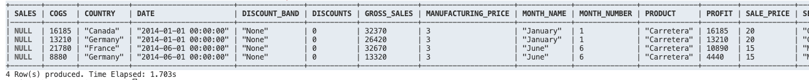

# An UDF to read a excel file from snowflake using python


You can run it like:

```bash
python register_udf.py --stage mystage --udfname excelread --imports @mystage/sample.xlsx --connection user=user1 account=account1 password=xxxx database=database1 schema=schema1 warehouse=warehouse1
```
or 

```
python register_udf.py --stage mystage --udfname excelread --imports @mystage/sample.xlsx --connection snowsql
```

After registration you can run it from snowflake like:

```sql
SELECT excelread('sample.xlsx',True,'Sheet1','A1:M5')
```
or

```sql
SELECT excelread('sample.xlsx',True,NULL,NULL)
```          

You can then do something like:
```sql
select value from lateral flatten(excelread('sample.xlsx',True,'Sheet1','A1:M5'));
```
Which for the example table will return:
```
+----------------------------------+                                            
| VALUE                            |
|----------------------------------|
| {                                |
|   " Sales": 32370,               |
|   "COGS": 16185,                 |
|   "Country": "Canada",           |
|   "Date": "2014-01-01 00:00:00", |
|   "Discount Band": "None",       |
|   "Discounts": 0,                |
|   "Gross Sales": 32370,          |
|   "Manufacturing Price": 3,      |
|   "Month Name": "January",       |
|   "Month Number": 1,             |
|   "Product": "Carretera",        |
|   "Profit": 16185,               |
|   "Sale Price": 20,              |
|   "Segment": "Government",       |
|   "Units Sold": 1618.5,          |
|   "Year": "2014"                 |
| }                                |
```

Or to completely flatten it:

```sql

select
value['Sales']               SALES,
value['COGS']                COGS,
value['Country']             COUNTRY,
value['Date']                DATE,
value['Discount Band']       Discount_Band,
value['Discounts']           Discounts,
value['Gross Sales']         Gross_Sales,
value['Manufacturing Price'] Manufacturing_Price,
value['Month Name']          Month_Name,
value['Month Number']        Month_Number,
value['Product']             Product,
value['Profit']              Profit,
value['Sale Price']          Sale_Price,
value['Segment']             Segment,
value['Units Sold']          Units_Sold,
value['Year']                Year   
from lateral flatten(excelread('sample.xlsx',True,'Sheet1','A1:M5'))

```

Will return:

